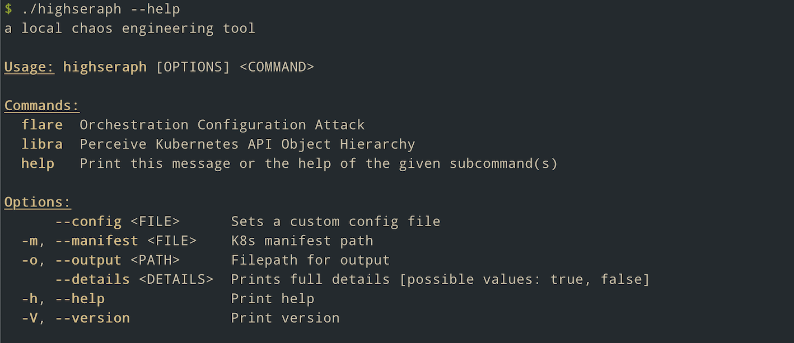

---

> chaos engineering via misconfiguration injection

---

The ultima 🙃 goal of this project is to develop a chaos engineering tool where misconfigurations are injected by determining the Kubernetes API Object Hierarchy of the declared resources. With Rust 🦀.

---

**v0.1.0**

- CLI scaffolding
- 

See [CHANGELOG](./CHANGELOG.md) for full update history.

---

Dual-licensed under [Apache 2.0](LICENSE-APACHE) or [MIT](LICENSE-MIT).
